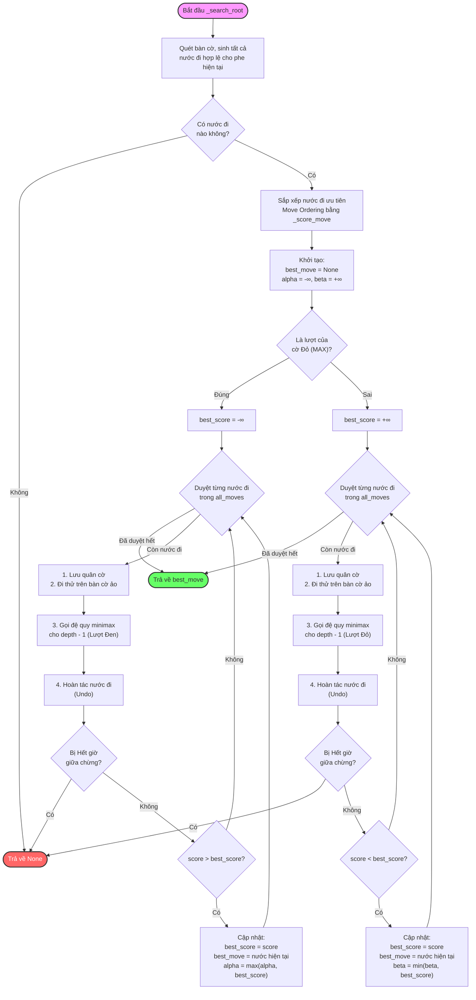

```mermaid
flowchart TD
    Start(["Bắt đầu _search_root"])
    EndNone(["Trả về None"])
    EndMove(["Trả về best_move"])

    Start --> GenMoves["Quét bàn cờ, sinh tất cả<br>nước đi hợp lệ cho phe hiện tại"]
    GenMoves --> CheckEmpty{"Có nước đi<br>nào không?"}

    CheckEmpty -- Không --> EndNone
    CheckEmpty -- Có --> SortMoves["Sắp xếp nước đi ưu tiên<br>Move Ordering bằng _score_move"]

    SortMoves --> InitVars["Khởi tạo:<br>best_move = None<br>alpha = -∞, beta = +∞"]
    InitVars --> CheckTurn{"Là lượt của<br>cờ Đỏ (MAX)?"}

    CheckTurn -- Đúng --> InitRed["best_score = -∞"]
    InitRed --> LoopRed{"Duyệt từng nước đi<br>trong all_moves"}

    LoopRed -- Đã duyệt hết --> EndMove

    LoopRed -- Còn nước đi --> MakeMoveRed["1. Lưu quân cờ<br>2. Đi thử trên bàn cờ ảo"]
    MakeMoveRed --> CallMiniMaxRed["3. Gọi đệ quy minimax<br>cho depth - 1 (Lượt Đen)"]
    CallMiniMaxRed --> UndoRed["4. Hoàn tác nước đi<br>(Undo)"]

    UndoRed --> TimeoutRed{"Bị Hết giờ<br>giữa chừng?"}
    TimeoutRed -- Có --> EndNone
    TimeoutRed -- Không --> CheckScoreRed{"score > best_score?"}

    CheckScoreRed -- Không --> LoopRed
    CheckScoreRed -- Có --> UpdateRed["Cập nhật:<br>best_score = score<br>best_move = nước hiện tại<br>alpha = max(alpha, best_score)"]
    UpdateRed --> LoopRed

    CheckTurn -- Sai --> InitBlack["best_score = +∞"]
    InitBlack --> LoopBlack{"Duyệt từng nước đi<br>trong all_moves"}

    LoopBlack -- Đã duyệt hết --> EndMove

    LoopBlack -- Còn nước đi --> MakeMoveBlack["1. Lưu quân cờ<br>2. Đi thử trên bàn cờ ảo"]
    MakeMoveBlack --> CallMiniMaxBlack["3. Gọi đệ quy minimax<br>cho depth - 1 (Lượt Đỏ)"]
    CallMiniMaxBlack --> UndoBlack["4. Hoàn tác nước đi<br>(Undo)"]

    UndoBlack --> TimeoutBlack{"Bị Hết giờ<br>giữa chừng?"}
    TimeoutBlack -- Có --> EndNone
    TimeoutBlack -- Không --> CheckScoreBlack{"score < best_score?"}

    CheckScoreBlack -- Không --> LoopBlack
    CheckScoreBlack -- Có --> UpdateBlack["Cập nhật:<br>best_score = score<br>best_move = nước hiện tại<br>beta = min(beta, best_score)"]
    UpdateBlack --> LoopBlack

    style Start fill:#f9f,stroke:#333,stroke-width:2px
    style EndNone fill:#f66,stroke:#333,stroke-width:2px,color:#fff
    style EndMove fill:#6f6,stroke:#333,stroke-width:2px
```
