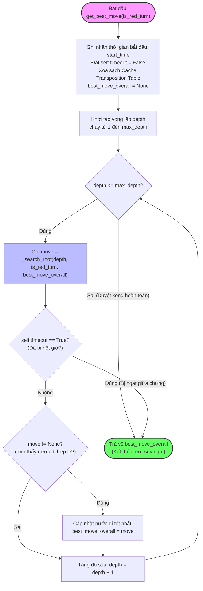

```mermaid
flowchart TD
    %% Định nghĩa các node
    Start(["Bắt đầu get_best_move(is_red_turn)"])
    Init["Ghi nhận thời gian bắt đầu: start_time<br>Đặt self.timeout = False<br>Xóa sạch Cache Transposition Table<br>best_move_overall = None"]

    LoopSetup["Khởi tạo vòng lặp depth<br>chạy từ 1 đến max_depth"]
    CheckLoop{"depth <= max_depth?"}

    CallSearch["Gọi move = _search_root(depth, is_red_turn, best_move_overall)"]
    CheckTimeout{"self.timeout == True?<br>(Đã bị hết giờ?)"}

    CheckMove{"move != None?<br>(Tìm thấy nước đi hợp lệ?)"}
    UpdateBest["Cập nhật nước đi tốt nhất:<br>best_move_overall = move"]

    NextIter["Tăng độ sâu: depth = depth + 1"]
    ReturnBest(["Trả về best_move_overall<br>(Kết thúc lượt suy nghĩ)"])

    %% Luồng đi của sơ đồ
    Start --> Init
    Init --> LoopSetup
    LoopSetup --> CheckLoop

    %% Vòng lặp chính
    CheckLoop -- Đúng --> CallSearch
    CheckLoop -- Sai (Duyệt xong hoàn toàn) --> ReturnBest

    CallSearch --> CheckTimeout

    %% Kiểm tra Timeout
    CheckTimeout -- Đúng (Bị ngắt giữa chừng) --> ReturnBest
    CheckTimeout -- Không --> CheckMove

    %% Kiểm tra kết quả nước đi
    CheckMove -- Đúng --> UpdateBest
    CheckMove -- Sai --> NextIter

    UpdateBest --> NextIter
    NextIter --> CheckLoop

    %% Định dạng màu sắc
    style Start fill:#f9f,stroke:#333,stroke-width:2px
    style ReturnBest fill:#6f6,stroke:#333,stroke-width:2px
    style CallSearch fill:#bbf,stroke:#333,stroke-width:1px
```
