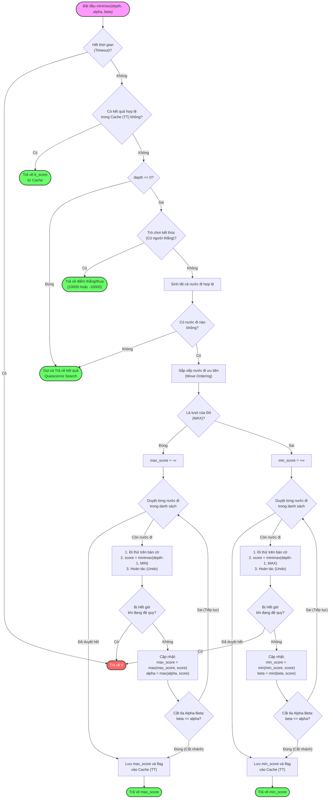

```mermaid
flowchart TD
    %% ==========================================
    %% 1. CÁC ĐIỂM DỪNG SỚM (EARLY EXITS)
    %% ==========================================
    Start(["Bắt đầu minimax(depth, alpha, beta)"])

    Start --> CheckTime{"Hết thời gian<br>(Timeout)?"}
    CheckTime -- Có --> ReturnZero(["Trả về 0"])

    CheckTime -- Không --> CheckTT{"Có kết quả hợp lệ<br>trong Cache (TT) không?"}
    CheckTT -- Có --> ReturnTT(["Trả về tt_score<br>từ Cache"])

    CheckTT -- Không --> CheckDepth{"depth == 0?"}
    CheckDepth -- Đúng --> ReturnQSearch(["Gọi và Trả về kết quả<br>Quiescence Search"])

    CheckDepth -- Sai --> CheckGameOver{"Trò chơi kết thúc<br>(Có người thắng)?"}
    CheckGameOver -- Có --> ReturnWinLoss(["Trả về điểm thắng/thua<br>(10000 hoặc -10000)"])

    %% ==========================================
    %% 2. CHUẨN BỊ NƯỚC ĐI
    %% ==========================================
    CheckGameOver -- Không --> GenMoves["Sinh tất cả nước đi hợp lệ"]
    GenMoves --> CheckEmptyMoves{"Có nước đi nào<br>không?"}

    CheckEmptyMoves -- Không --> ReturnQSearch
    CheckEmptyMoves -- Có --> SortMoves["Sắp xếp nước đi ưu tiên<br>(Move Ordering)"]

    SortMoves --> CheckTurn{"Là lượt của Đỏ<br>(MAX)?"}

    %% ==========================================
    %% 3. NHÁNH TÌM MAX (CỜ ĐỎ)
    %% ==========================================
    CheckTurn -- Đúng --> InitMax["max_score = -∞"]
    InitMax --> LoopMax{"Duyệt từng nước đi<br>trong danh sách"}

    LoopMax -- Đã duyệt hết --> SaveTTMax["Lưu max_score và flag<br>vào Cache (TT)"]
    SaveTTMax --> ReturnMax(["Trả về max_score"])

    LoopMax -- Còn nước đi --> ProcessMax["1. Đi thử trên bàn cờ<br>2. score = minimax(depth-1, MIN)<br>3. Hoàn tác (Undo)"]
    ProcessMax --> CheckTimeoutMax{"Bị Hết giờ<br>khi đang đệ quy?"}

    CheckTimeoutMax -- Có --> ReturnZero
    CheckTimeoutMax -- Không --> UpdateMax["Cập nhật:<br>max_score = max(max_score, score)<br>alpha = max(alpha, score)"]

    UpdateMax --> PruneMax{"Cắt tỉa Alpha-Beta:<br>beta <= alpha?"}
    PruneMax -- Đúng (Cắt nhánh) --> SaveTTMax
    PruneMax -- Sai (Tiếp tục) --> LoopMax

    %% ==========================================
    %% 4. NHÁNH TÌM MIN (CỜ ĐEN)
    %% ==========================================
    CheckTurn -- Sai --> InitMin["min_score = +∞"]
    InitMin --> LoopMin{"Duyệt từng nước đi<br>trong danh sách"}

    LoopMin -- Đã duyệt hết --> SaveTTMin["Lưu min_score và flag<br>vào Cache (TT)"]
    SaveTTMin --> ReturnMin(["Trả về min_score"])

    LoopMin -- Còn nước đi --> ProcessMin["1. Đi thử trên bàn cờ<br>2. score = minimax(depth-1, MAX)<br>3. Hoàn tác (Undo)"]
    ProcessMin --> CheckTimeoutMin{"Bị Hết giờ<br>khi đang đệ quy?"}

    CheckTimeoutMin -- Có --> ReturnZero
    CheckTimeoutMin -- Không --> UpdateMin["Cập nhật:<br>min_score = min(min_score, score)<br>beta = min(beta, score)"]

    UpdateMin --> PruneMin{"Cắt tỉa Alpha-Beta:<br>beta <= alpha?"}
    PruneMin -- Đúng (Cắt nhánh) --> SaveTTMin
    PruneMin -- Sai (Tiếp tục) --> LoopMin

    %% Styling
    style Start fill:#f9f,stroke:#333,stroke-width:2px
    style ReturnZero fill:#f66,stroke:#333,stroke-width:2px,color:#fff
    style ReturnTT fill:#6f6,stroke:#333,stroke-width:2px
    style ReturnQSearch fill:#6f6,stroke:#333,stroke-width:2px
    style ReturnWinLoss fill:#6f6,stroke:#333,stroke-width:2px
    style ReturnMax fill:#6f6,stroke:#333,stroke-width:2px
    style ReturnMin fill:#6f6,stroke:#333,stroke-width:2px
```
