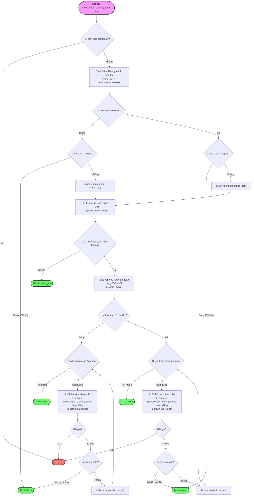

```mermaid
flowchart TD
    %% Định nghĩa các node ban đầu
    Start(["Bắt đầu quiescence_search(alpha, beta)"])
    CheckTime{"Hết thời gian (Timeout)?"}
    ReturnZero(["Trả về 0"])

    Start --> CheckTime
    CheckTime -- Có --> ReturnZero

    %% Khối tính Stand Pat
    CheckTime -- Không --> CalcStandPat["Tính điểm đánh giá tĩnh hiện tại:<br>stand_pat = evaluator.evaluate()"]
    CalcStandPat --> CheckTurn{"Là lượt của Đỏ (MAX)?"}

    %% ==========================================
    %% LỌC STAND PAT CHO PHÂN NHÁNH MAX / MIN
    %% ==========================================
    CheckTurn -- Đúng --> StandPatMax{"stand_pat >= beta?"}
    StandPatMax -- Đúng (Cắt tỉa) --> ReturnBeta(["Trả về beta"])
    StandPatMax -- Không --> UpdateAlpha["alpha = max(alpha, stand_pat)"]

    CheckTurn -- Sai --> StandPatMin{"stand_pat <= alpha?"}
    StandPatMin -- Đúng (Cắt tỉa) --> ReturnAlpha(["Trả về alpha"])
    StandPatMin -- Không --> UpdateBeta["beta = min(beta, stand_pat)"]

    %% ==========================================
    %% SINH NƯỚC ĂN QUÂN & SẮP XẾP
    %% ==========================================
    UpdateAlpha --> GenCaptures["Chỉ sinh các nước ĂN QUÂN<br>(captures_only=True)"]
    UpdateBeta --> GenCaptures

    GenCaptures --> CheckCaptures{"Có nước ăn quân nào không?"}
    CheckCaptures -- Không --> ReturnStandPat(["Trả về stand_pat"])

    CheckCaptures -- Có --> SortCaptures["Sắp xếp các nước ăn quân<br>bằng MVV-LVA (_score_move)"]
    SortCaptures --> CheckTurnLoop{"Là lượt của Đỏ (MAX)?"}

    %% ==========================================
    %% VÒNG LẶP ĐỆ QUY CHO PHE MAX
    %% ==========================================
    CheckTurnLoop -- Đúng --> LoopMax{"Duyệt từng nước ăn quân"}
    LoopMax -- Hết nước --> ReturnFinalAlpha(["Trả về alpha"])

    LoopMax -- Còn nước --> ProcessMax["1. Đi thử trên bàn cờ ảo<br>2. score = quiescence_search(alpha, beta, MIN)<br>3. Hoàn tác (Undo)"]
    ProcessMax --> TimeCheckMax{"Hết giờ?"}
    TimeCheckMax -- Có --> ReturnZero
    TimeCheckMax -- Không --> CutoffMax{"score >= beta?"}
    CutoffMax -- Đúng (Cắt tỉa) --> ReturnBeta
    CutoffMax -- Không --> NextMax["alpha = max(alpha, score)"] --> LoopMax

    %% ==========================================
    %% VÒNG LẶP ĐỆ QUY CHO PHE MIN
    %% ==========================================
    CheckTurnLoop -- Sai --> LoopMin{"Duyệt từng nước ăn quân"}
    LoopMin -- Hết nước --> ReturnFinalBeta(["Trả về beta"])

    LoopMin -- Còn nước --> ProcessMin["1. Đi thử trên bàn cờ ảo<br>2. score = quiescence_search(alpha, beta, MAX)<br>3. Hoàn tác (Undo)"]
    ProcessMin --> TimeCheckMin{"Hết giờ?"}
    TimeCheckMin -- Có --> ReturnZero
    TimeCheckMin -- Không --> CutoffMin{"score <= alpha?"}
    CutoffMin -- Đúng (Cắt tỉa) --> ReturnAlpha
    CutoffMin -- Không --> NextMin["beta = min(beta, score)"] --> LoopMin

    %% Định dạng màu sắc sơ đồ
    style Start fill:#f9f,stroke:#333,stroke-width:2px
    style ReturnZero fill:#f66,stroke:#333,stroke-width:2px,color:#fff
    style ReturnBeta fill:#6f6,stroke:#333,stroke-width:2px
    style ReturnAlpha fill:#6f6,stroke:#333,stroke-width:2px
    style ReturnStandPat fill:#6f6,stroke:#333,stroke-width:2px
    style ReturnFinalAlpha fill:#6f6,stroke:#333,stroke-width:2px
    style ReturnFinalBeta fill:#6f6,stroke:#333,stroke-width:2px
```
