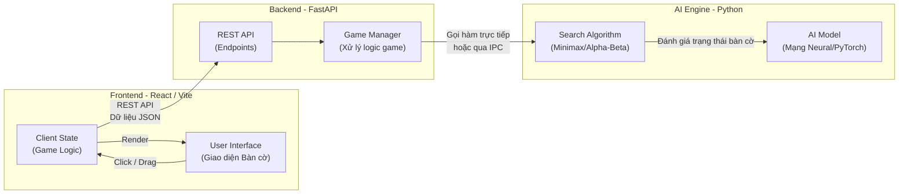

```mermaid
graph LR
    %% Khối Frontend
    subgraph Frontend [Frontend - React / Vite]
        ClientState["Client State<br>(Game Logic)"]
        UI["User Interface<br>(Giao diện Bàn cờ)"]

        ClientState -->|Render| UI
        UI -->|Click / Drag| ClientState
    end

    %% Khối Backend
    subgraph Backend [Backend - FastAPI]
        API["REST API<br>(Endpoints)"]
        GameManager["Game Manager<br>(Xử lý logic game)"]

        API --> GameManager
    end

    %% Khối AI Engine
    subgraph AIEngine [AI Engine - Python]
        SearchAlgo["Search Algorithm<br>(Minimax/Alpha-Beta)"]
        AIModel["AI Model<br>(Mạng Neural/PyTorch)"]

        SearchAlgo -->|Đánh giá trạng thái bàn cờ| AIModel
    end

    %% Các liên kết giữa các khối
    ClientState -->|REST API<br>Dữ liệu JSON| API
    GameManager -->|Gọi hàm trực tiếp<br>hoặc qua IPC| SearchAlgo
```
