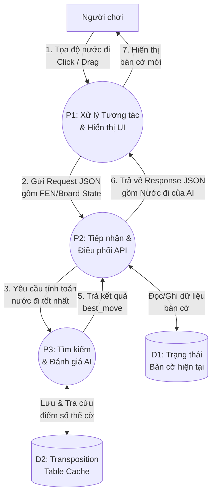

```mermaid
graph TD
    %% Khai báo các Thực thể (External Entities)
    User[Người chơi]

    %% Khai báo các Tiến trình xử lý (Processes) - Hình tròn
    P1((P1: Xử lý Tương tác<br>& Hiển thị UI))
    P2((P2: Tiếp nhận &<br>Điều phối API))
    P3((P3: Tìm kiếm<br>& Đánh giá AI))

    %% Khai báo các Kho dữ liệu (Data Stores) - Hình cơ sở dữ liệu
    D1[(D1: Trạng thái<br>Bàn cờ hiện tại)]
    D2[(D2: Transposition<br>Table Cache)]

    %% Luồng dữ liệu (Data Flows)
    User -->|1. Tọa độ nước đi<br>Click / Drag| P1
    P1 -->|7. Hiển thị<br>bàn cờ mới| User

    P1 -->|2. Gửi Request JSON<br>gồm FEN/Board State| P2
    P2 -->|6. Trả về Response JSON<br>gồm Nước đi của AI| P1

    P2 -->|3. Yêu cầu tính toán<br>nước đi tốt nhất| P3
    P3 -->|5. Trả kết quả<br>best_move| P2

    %% Tương tác với Kho dữ liệu
    P2 <-->|Đọc/Ghi dữ liệu<br>bàn cờ| D1
    P3 <-->|Lưu & Tra cứu<br>điểm số thế cờ| D2
```
